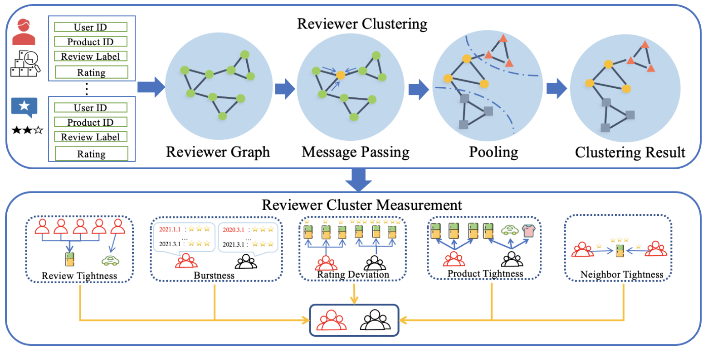

# Fake Reviewer Group Detection in Online Review Systems
Official implementation of Fake Reviewer Group Detection in Online Review Systems (REAL) [1]




## References

[1] [ C. Cao, S. Li, S. Yu and Z. Chen, "Higher-order Structure Based Anomaly Detection on Attributed Networks," *2021 International Conference on Data Mining Workshops (ICDMW)*, Auckland, New Zealand, 2021, pp. 935-942, doi: 10.1109/ICDMW53433.2021.00122.](https://ieeexplore.ieee.org/abstract/document/9680022)


## Cite

Please cite our paper if you use this code in your own work:
```latex
@INPROCEEDINGS{9680022,
  author={Cao, Chen and Li, Shihao and Yu, Shuo and Chen, Zhikui},
  booktitle={2021 International Conference on Data Mining Workshops (ICDMW)}, 
  title={Fake Reviewer Group Detection in Online Review Systems}, 
  year={2021},
  pages={935-942},
  doi={10.1109/ICDMW53433.2021.00122}
  }
```
